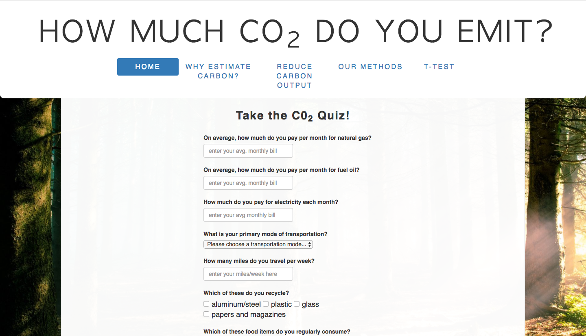

# Carbon Estimator

##### Epicodus Section: Intro group week - Carbon Estimator

#### By Grady L Shelton, Dana Weiss, & Ben Williams

## Description

This group week website takes user input about their day-to-day activities including how far they travel on a weekly basis,  what modes of transportation they use, what energy fuels their house and how much they use (deduced from amount paid per month), how much they recycle, and what kind of food they regularly eat and then displays an estimate for how much carbon dioxide they are responsible for emitting on a monthly basis. There is a t-test calculator on an additional page that can be used to compare the current cohorts of Epicodus against each other to evaluate who emits less carbon dioxide. Additional links provide valuable information regarding tips to reduce carbon dioxide output, why reducing carbon dioxide is important, and the methodology behind the calculator.

Website can be viewed in browser at https://gravytates.github.io/carbon-estimator

## Specifications

* Program will have the user indicate how many miles they travel per week.
  * **Example Input** User inputs " '100' miles."
  * **Example Output** Program allows user to move on to mode of transportation.

* User indicates whether they drive a car (sedan/wagon, hybrid, small truck, standard truck), take the bus, lightrail, or walk/bike. Mode has a standard CO2 lbs emission that is multiplied by their miles traveled and their transportation; CO2 emissions are displayed.
  * **Example Input** User selects "Bus" and 100 miles.
  * **Example Output** Transportation CO2 emission: 225.3 lbs per month.

* Program will prompt user to indicate if they recycle the following items:          
    aluminum/steel
    plastic
    glass
    newspaper
    magazines
  * **Example Input** User selects "aluminum/steel, plastic, glass, newspaper, magazines".
  * **Example Output** "waste emission: 33.15 lbs CO2/month".

* Program will prompt user to indicate how many pounds of certain food types they eat per week to see how much CO2/wk the production of this food creates.
  * **Example Input** User selects "Beef: 2 lbs; Rice: 2 lbs; Vegetables: 5 lbs."
  * **Example Output** "CO2 emission from food: 302.5 lbs CO2/month"

* Program will prompt user to indicate what kind of fuel their home energy uses, and how much money is spent on utility.
  * **Example Input** User selects either "Electricity" and "$44/month"
  * **Example Output** "CO2 emission from utilities: 4046.3 lbs/month"

* Upon completion and submission of form, program will return a total CO2 emission in pounds per week.
  * **Example Input** User submits form
  * **Example Output** "Your CO2 emission per month is: 1070.57 lbs"

  * User can enter emission data into t-test inputs for the different cohorts currently enrolled at Epicodus to see raw cohort data.
    * **Example Input** User inputs at least two results a class: "5231, 5500"
    * **Example Output** Intro to Programming total lbs of CO2 emission: 10731; Average emission: 5365.50; Standard deviation: 190.21

* User can enter emission data into t-test inputs for the different cohorts currently enrolled at Epicodus to evaluate differences between cohort results.
  * **Example Input** User inputs at least two results each for two different classes: "5231, 5500" & "5899, 6000"
  * **Example Output** t-result: 4.065 dF: 2; with alpha of 0.05 this result is null hypothesis rejected, two results are not similar.

## Screenshot

## Setup/Installation Requirements

- [ ] Clone this repository
- [ ] Create new branch to make changes to code
- [ ] Open files in atom or text editor of your choice
- [ ] Open index.html in browser of your choice

## Known Bugs
No known bugs, but Mercury is in retrograde so your guess is as good as mine.
Also, t-test calculator needs intro results submitted before any of the three t-tests to take place (regardless if the intro data is being evaluated).

## Contact

Please contact Grady L Shelton at gradyish@gmail.com if you have any questions.

## Technologies Used

HTML, CSS, Bootstrap, JavaScript and jQuery

### Legal

Copyright (c) 2017 **Grady L Shelton, Ben Williams, and Dana Weiss**

This software is licensed under the MIT license.

Permission is hereby granted, free of charge, to any person obtaining a copy
of this software and associated documentation files (the "Software"), to deal
in the Software without restriction, including without limitation the rights
to use, copy, modify, merge, publish, distribute, sublicense, and/or sell
copies of the Software, and to permit persons to whom the Software is
furnished to do so, subject to the following conditions:

The above copyright notice and this permission notice shall be included in
all copies or substantial portions of the Software.

THE SOFTWARE IS PROVIDED "AS IS", WITHOUT WARRANTY OF ANY KIND, EXPRESS OR
IMPLIED, INCLUDING BUT NOT LIMITED TO THE WARRANTIES OF MERCHANTABILITY,
FITNESS FOR A PARTICULAR PURPOSE AND NONINFRINGEMENT. IN NO EVENT SHALL THE
AUTHORS OR COPYRIGHT HOLDERS BE LIABLE FOR ANY CLAIM, DAMAGES OR OTHER
LIABILITY, WHETHER IN AN ACTION OF CONTRACT, TORT OR OTHERWISE, ARISING FROM,
OUT OF OR IN CONNECTION WITH THE SOFTWARE OR THE USE OR OTHER DEALINGS IN
THE SOFTWARE.
